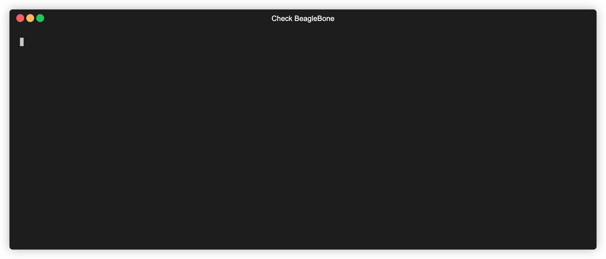
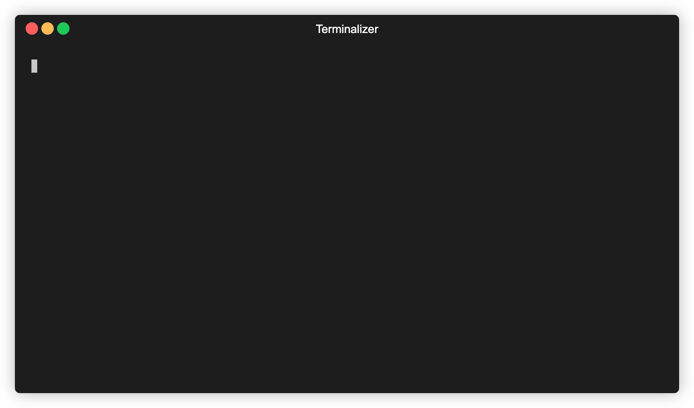

# Introduction

This repository consists of the scripts that are used during the exploitation of Beaglebone Black..

## check_bbb.py

The `check_bbb.py` script is going to check for the presence of Beaglebone on network. It's as simple as providing an `IP Address` to it. Optionally, since the scipt uses a signature based detection, it also allows specifying Cloud9 port and NiSysServer port. If these addresses are not provided, the script will look for them on their default port.

There are 3 Criterions that are utilized to check for the presence of a BBB:

1. [SSH Vulnerable to user enumeration](https://www.exploit-db.com/exploits/45233)
2. Misconfigured Cloud9
3. Vulnerable NiSysServer.py

Check Vulnerable Version of BBB using: 


```bash
✗ python3 check_bbb.py -h
```

```bash
usage: check_bbb.py [-h] [-c9 C9PORT] [-Ni NISYSSERVER_PORT] target

positional arguments:
  target                Set the address of target BBB host

optional arguments:
  -h, --help            show this help message and exit
  -c9 C9PORT, --cloud9-port C9PORT
                        Set the address cloud9 of port
  -Ni NISYSSERVER_PORT, -nisysserver-port NISYSSERVER_PORT
                        Set the address NiSysServer.py port
```

### Installation

```
➜ git clone https://github.com/MilindPurswani/beaglebone.git 
➜ pip3 install -r requirements.txt
```

### Working



## Labview Denial of Service

Create a DOS against the BBB's Labview Service by restarting it repeatedly using the exposed `/rtexecsvc/RebootEx` endpoint.

```bash
✗ python3 exploit.py -h
```
```bash
usage: exploit.py [-h] [-c  COUNT] [-p PORT] [-d DURATION] target

positional arguments:
  target                Set the address of target BBB host

optional arguments:
  -h, --help            show this help message and exit
  -c  COUNT, --count COUNT
                        Number of Requests you want to send to DOS
  -p PORT, --port PORT  Set the address of port
  -d DURATION, --duration DURATION
                        The duration for which the exploit should persist
```

### Installation

```
➜ git clone https://github.com/MilindPurswani/beaglebone.git 
➜ pip3 install -r requirements.txt
```

### Working



## SSH User Enumeration

It was discovered that the Beaglebone Black was vulnerable to local user enumeration over ssh. Credits to [Justin Gardner](https://www.exploit-db.com/exploits/45233) for finding this flaw. 

With some slight modifications to his python script, we were able to validate existance of valid users on Beaglebone devices. 

```
✗ python3 ssh_user_enum.py -h
```

```
usage: ssh_user_enum.py [-h] [--port PORT] [--threads THREADS]
                        [--outputFile OUTPUTFILE]
                        [--outputFormat {list,json,csv}]
                        (--username USERNAME | --userList USERLIST)
                        hostname

positional arguments:
  hostname              The target hostname or ip address

optional arguments:
  -h, --help            show this help message and exit
  --port PORT           The target port
  --threads THREADS     The number of threads to be used
  --outputFile OUTPUTFILE
                        The output file location
  --outputFormat {list,json,csv}
                        The output file location
  --username USERNAME   The single username to validate
  --userList USERLIST   The list of usernames (one per line) to enumerate
                        through
```

### Installation

```
➜ git clone https://github.com/MilindPurswani/beaglebone.git 
➜ pip3 install -r requirements.txt
```

### Working:


